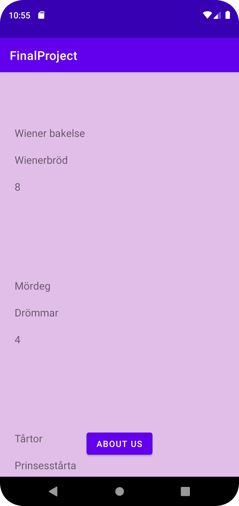
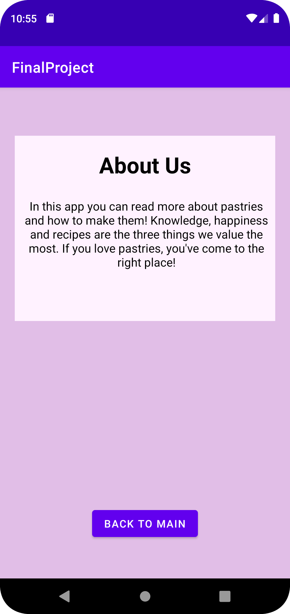

# Rapport

Jag har skapat en app om bakverk då baka är ett stort intresse hos mig. Denna app är tänkt att inspirera sina åskådare med olika typer av bakelser. Datan som valts att användas för denna app är namnet, id:t och storleken. Appen är uppbyggd på en RecyclerView och tre olika TextViews. Dessa har stylats med bakgrundfärg, textstorlekar och olika margin.

Nedan kan koden från RecyclerView:n hittas:

```
<androidx.recyclerview.widget.RecyclerView
        android:id="@+id/recyclerView"
        android:layout_width="match_parent"
        android:layout_height="match_parent"
        app:layout_constraintStart_toStartOf="parent"
        app:layout_constraintEnd_toEndOf="parent" />
```

En adapter har även skapats för att möjliggöra att recyclerView:n fungerar. Nedan kan man läsa koden tagen från MainActivity filen i Java där dessa kopplas ihop:

```
@Override
protected void onCreate(Bundle savedInstanceState) {
super.onCreate(savedInstanceState);
setContentView(R.layout.activity_main);
Button button = findViewById(R.id.start_second_activity);
adapter = new CupcakeAdapter();
cupcakeList = new ArrayList<Cupcake>();

        recyclerView = findViewById(R.id.recyclerView);
        recyclerView.setLayoutManager(new LinearLayoutManager(this));
        recyclerView.setAdapter(adapter);
```

En about-sida har även skapats till appen där man kan läsa mer om syftet för applikationen. Detta är gjorts genom att en till activity har skapats vid namn "activity_second". Både activity_main och activity_second har sedan blivit ihopkopplade med en knapp. Denna knapp tar användaren från en activity till en annan sömlöst.
Nedan kan kod läsas om hur en av knapparna har skapats i activity_second filen:

```
<Button
android:id="@+id/close_second_activity"
android:layout_width="wrap_content"
android:layout_height="wrap_content"
android:layout_marginBottom="30dp"
android:text="Back to main"
app:layout_constraintBottom_toBottomOf="parent"
app:layout_constraintLeft_toLeftOf="parent"
app:layout_constraintRight_toRightOf="parent" />
```

Nedan kan man se hur appens förstasida ser ut samt about-sidan:



